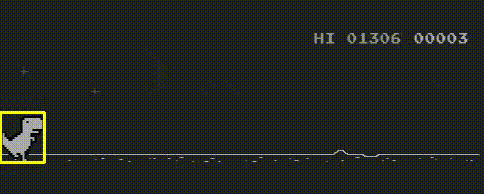

# 🦖 Chrome Dino Bot (YOLO) — Vision + Auto‑play (offline)

Un petit projet “fun” : un bot qui joue au jeu **Chrome Dino** en détectant en temps réel le **dino**, les **cactus** et les **birds** via un modèle **YOLO fine‑tuné**, puis en déclenchant les actions **jump / duck** au bon moment.

🎯 Pipeline : **capture écran → détection YOLO → décision → contrôle clavier**

---

## 🎬 Démo




---

## ✨ Fonctionnalités

- Capture temps réel de la zone de jeu (**ROI**) avec `mss`
- Détection temps réel avec **Ultralytics YOLO**
- Modèle fine‑tuné sur 3 classes :
  - `dino`
  - `cactus`
  - `bird`
- Visualisation live (fenêtre OpenCV) :
  - bounding boxes par classe
  - zone de danger (rouge) selon la vitesse estimée
- Contrôle clavier :
  - `SPACE` pour sauter
  - `DOWN` pour se baisser (duck)
- Logs de debug (optionnel) : cible, distances, TTI, raisons des “locks”, etc.

---

## 🧠 Comment ça marche

### 1) Détection
À chaque frame :
1. capture d’écran (ROI)
2. inference YOLO
3. sélection de la **cible la plus dangereuse** (obstacle devant le dino)

### 2) Timing (TTI)
Pour décider *quand* agir, on estime la vitesse horizontale des obstacles, puis on calcule un **Time‑To‑Impact** :

- `TTI = distance / vitesse`

En pratique, on estime la vitesse en pixels/sec en regardant le déplacement d’un obstacle entre deux frames.

### 3) Décision
- **Cactus** : saut quand `TTI` passe sous un seuil (avec “lead” en X pour éviter de sauter trop tôt sur les cactus larges)
- **Bird** : action dépend de la position verticale :
  - **haut** → rien
  - **intermédiaire** → duck
  - **bas** → jump
- “Urgence bird” : si un oiseau arrive pendant une fenêtre de lock de saut, on autorise un override pour éviter la collision.

---

## 🗂️ Structure du projet (exemple)

> Adapte si tes fichiers ont d’autres noms.

```
.
├── bot_live.py                 # bot live (capture + inference + actions)
├── bot_live_logs.py            # variante avec logs terminal (debug)
├── roi_viewer.py               # outil pour calibrer la ROI sur ton écran
├── calibrate.py                # calcule des stats/seuils depuis le dataset (optionnel)
├── dino_dataset/
│   ├── images/train/
│   ├── labels/train/
│   ├── data.yaml
│   └── train.txt
└── runs/                       # outputs Ultralytics (weights, logs, etc.)
```

---

## ⚙️ Installation

### Prérequis
- Python 3.9+ recommandé
- Chrome (jeu en fenêtre)

### Setup
```bash
python -m venv dino
source dino/bin/activate

pip install -U pip
pip install ultralytics opencv-python mss pynput numpy
```

> Note : sur macOS, `pynput` peut nécessiter d’autoriser l’accessibilité (contrôle clavier) :
> **Réglages Système → Confidentialité et sécurité → Accessibilité**.

---

## 🏋️ Fine‑tune YOLO (rappel)

Ton `data.yaml` doit contenir **train + val** :

```yaml
path: dino_dataset
train: images/train
val: images/train

names:
  0: cactus
  1: bird
  2: dino
```

Lancer l’entraînement (exemple) :
```bash
yolo detect train data=dino_dataset/data.yaml model=yolov8n.pt imgsz=640 epochs=80
```

Les poids finaux seront typiquement ici :
```
runs/detect/train/weights/best.pt
```

---

## ▶️ Lancer le bot

1) Ouvre Chrome Dino en **fenêtre** (pas plein écran)  
2) Ajuste la ROI si nécessaire (voir section suivante)  
3) Lance :

```bash
python bot_live.py
```

**Contrôles**
- `ESC` : quitter

---

## 🧩 Calibration ROI

Avant tout, règle la zone de capture (ROI) pour ne capturer **que** la zone de jeu.
Le script `roi_viewer.py` sert à visualiser la capture et ajuster `left/top/width/height`.

Exemple :
```bash
python roi_viewer.py
```

Ensuite, reporte la ROI dans `bot_live.py` :
```python
ROI = {"left": 68, "top": 175, "width": 484, "height": 194}
```

---

## 🐛 Debug & logs

Si tu utilises la version logs :
```bash
python bot_live_logs.py
```

Les logs typiques montrent :
- la cible actuelle (`TARGET=...`)
- `dist_hit`, `tti`, `speed`
- la classification bird (HIGH / MID / LOW)
- et les raisons de blocage (cooldown / lock)

C’est idéal pour ajuster :
- `TTI_JUMP`, `TTI_DUCK`
- seuils “urgence”
- durée du duck
- paramètres de lock/cooldowns

---

## 🔧 Paramètres utiles à tuner

- **Cactus**
  - `LEAD_FRAC_CACTUS` : plus grand = saut plus tard sur cactus larges
- **Bird**
  - logique bird (haut/mid/bas) + override urgence
  - durée duck (si tu “duck” trop court ou trop long)
- **Timing**
  - `TTI_JUMP`, `TTI_DUCK` : seuils de déclenchement
  - `AIRBORNE_LOCK`, `JUMP_COOLDOWN` : anti-spam et stabilité

---

## 🚧 Limites & idées d’amélioration

- Stabiliser le tracking vitesse avec une association IoU (petit tracker)
- Export ONNX / CoreML pour accélérer sur Mac
- Enregistrement automatique de dataset + auto‑label assisté
- Meilleure split `train/val` + augmentation de données
- Un mode “pause/reprise” au clavier

---


